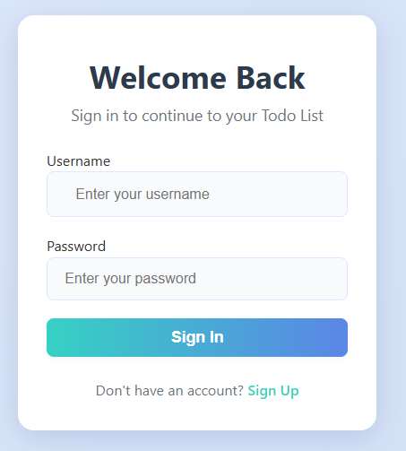
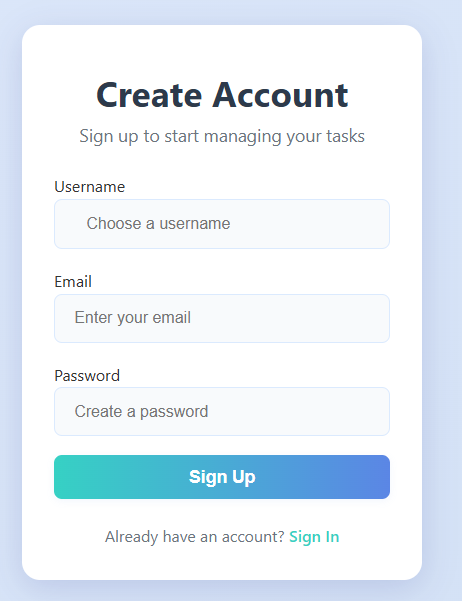
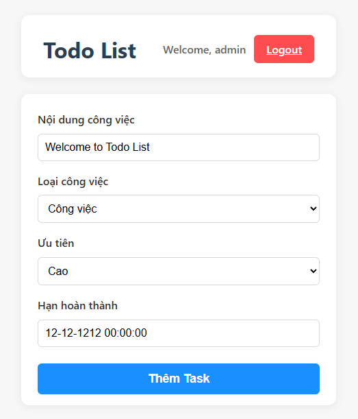
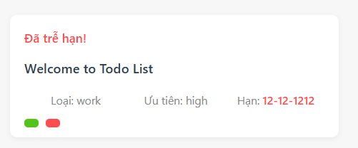
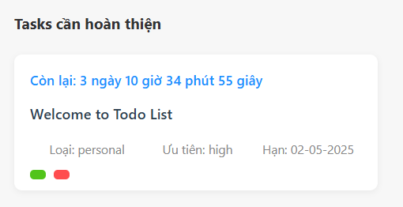
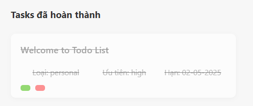

# Todo List App - Fullstack DevOps Demo

## 🚀 Tổng quan công nghệ
Dự án Todo List này tích hợp hàng loạt công nghệ hiện đại, phù hợp cho học tập, demo DevOps, Cloud Native, Microservices:

- **Node.js & Express**: Backend API, server-side rendering.
- **MySQL & Sequelize**: Lưu trữ dữ liệu, ORM.
- **Docker & Docker Compose**: Đóng gói, triển khai đa dịch vụ.
- **Prometheus & Grafana**: Monitoring, metrics, dashboard.
- **Redis**: Caching, session store, rate limiting.
- **Kafka (Kafkajs)**: Message queue, event-driven, microservices.
- **Socket.io**: Realtime notification, live update.
- **Multer**: Upload file, lưu trữ file server.
- **Winston & Morgan**: Logging nâng cao.
- **Swagger (swagger-ui-express)**: Tài liệu hóa API, test API trực tiếp.
- **GitHub Actions**: CI/CD tự động build, test, build Docker image.
- **Render.com**: Cloud deploy, auto build & deploy khi push code.

## 📝 Mô tả dự án
Đây là dự án Todo List App giúp người dùng quản lý công việc cá nhân một cách hiệu quả, trực quan và hiện đại. Ứng dụng được xây dựng với mục tiêu:
- Đơn giản hóa việc tạo, theo dõi, hoàn thành và xóa các nhiệm vụ hàng ngày.
- Hỗ trợ đăng ký/đăng nhập, bảo mật tài khoản.
- Theo dõi tiến độ, deadline, ưu tiên công việc.
- Dễ dàng mở rộng, tích hợp các công nghệ DevOps, Cloud, Monitoring.

**Tính năng nổi bật:**
- Quản lý công việc (CRUD Todo, deadline, trạng thái hoàn thành).
- Đăng ký/đăng nhập, bảo mật tài khoản.
- Giao diện hiện đại, responsive, UX thân thiện.
- Tích hợp Prometheus & Grafana để giám sát hiệu năng, sức khỏe hệ thống.
- CI/CD tự động với GitHub Actions: kiểm tra, test, build Docker image mỗi lần push code.
- Dễ dàng triển khai trên Docker, Cloud, hoặc server cá nhân.

**Ý nghĩa thực tiễn:**
- Phù hợp cho cá nhân, nhóm nhỏ, sinh viên học DevOps, Backend, Cloud.
- Là mẫu dự án hoàn chỉnh để học CI/CD, Docker, Monitoring, Cloud Deploy.
- Có thể mở rộng thành hệ thống quản lý công việc cho doanh nghiệp nhỏ.

**Hướng phát triển mở rộng:**
- Thêm tính năng thông báo qua email, push notification.
- Tích hợp OAuth (Google, Facebook, GitHub login).
- Đa ngôn ngữ, giao diện dark mode.
- Triển khai microservices, sử dụng message queue (RabbitMQ, Kafka).
- Tích hợp các dịch vụ cloud (AWS, GCP, Azure) và auto deploy.

## 🌟 Minh họa giao diện

### Đăng nhập


### Đăng ký tài khoản


### Thêm công việc mới


### Thông báo thêm task thành công


### Task đã trễ hạn


### Task còn thời gian hoàn thành


### Task đã hoàn thành


## 🚀 Hướng dẫn cài đặt & chạy

### 1. Clone dự án
```bash
[git clone https://github.com/NguyenAnhDucDev/to_do_list_nodejs
cd to_do_list
```

### 2. Chạy bằng Docker Compose
```bash
docker-compose up --build
```
- Ứng dụng Node.js: http://localhost:3001
- Prometheus: http://localhost:9090
- Grafana: http://localhost:3000
- MySQL: localhost:3307 (user: root, pass: examplepassword)

### 3. Đăng nhập mặc định
- Username: `admin`
- Password: `admin123`

### 4. Truy cập metrics Prometheus
- http://localhost:3001/metrics

### 5. Truy cập dashboard Grafana
- Đăng nhập mặc định: `admin` / `admin`
- Thêm data source Prometheus: `http://prometheus:9090`

## 🛠️ Cấu trúc thư mục
```
to_do_list/
├── app.js                # Main server file
├── Dockerfile            # Docker build file
├── docker-compose.yml    # Docker Compose config
├── package.json          # Node.js dependencies
├── prometheus.yml        # Prometheus config
├── init-db.js            # Script khởi tạo DB và user mẫu
├── public/               # Static files (CSS, JS, images, uploads)
├── models/               # Sequelize models (User, Todo)
├── views/                # EJS templates (login, register, index)
├── config/               # Cấu hình DB
├── logs/                 # Log files
├── tests/                # Unit tests
└── .github/workflows/    # CI/CD workflow (GitHub Actions)
```

## ⚡ CI/CD với GitHub Actions
- Tự động kiểm tra, test, build Docker image khi push/pull request vào nhánh `main`.
- File workflow: `.github/workflows/ci-cd.yml`

## 📊 Monitoring với Prometheus & Grafana
- Prometheus tự động scrape metrics từ Node.js app (`/metrics`).
- Grafana trực quan hóa dữ liệu metrics, tạo dashboard tuỳ ý.

## 💡 Lưu ý khi phát triển
- **Không copy `node_modules` từ máy thật vào container.** Để Docker tự cài khi build.
- Khi sửa code, chỉ cần restart lại container `node-app`.
- Nếu thêm package mới, vào container và chạy `npm install`.
- Không bật MySQL/XAMPP trên máy thật khi dùng Docker (tránh trùng cổng).

## 🧑‍💻 Đóng góp & mở rộng
- Fork, tạo branch, pull request như các dự án open source khác.
- Có thể mở rộng thêm: email notification, cloud deploy, OAuth, v.v.

## 📤 File upload & storage
- API upload file: `POST /upload` (multipart/form-data, field: file)
- File sẽ được lưu vào thư mục `public/uploads/` trên server.
- Có thể mở rộng lưu trữ lên cloud (S3, GCS, Azure Blob) nếu cần.

## 🚀 CI/CD nâng cao & Cloud Deploy với Render.com
### 1. Đăng ký tài khoản tại [https://render.com/](https://render.com/)
### 2. Kết nối GitHub repo của bạn
- Chọn **New Web Service** → **Connect your GitHub** → Chọn repo `to_do_list_nodejs`.
- Chọn **Docker** (vì bạn đã có Dockerfile).
- Thiết lập port (3001), biến môi trường (DB, REDIS, ...).
- Nhấn **Create Web Service** và chờ build/deploy tự động.

### 3. Database & Redis
- Render hỗ trợ tạo dịch vụ PostgreSQL/MySQL/Redis riêng, hoặc bạn có thể dùng dịch vụ cloud DB khác.
- Cập nhật biến môi trường kết nối DB/Redis trong Render.

### 4. CI/CD tự động
- Mỗi lần push code lên GitHub, Render sẽ tự động build & deploy lại app.

### 5. Tham khảo:
- [Render Node.js Docker Deploy](https://render.com/docs/deploy-node-docker)
- [Render Environment Variables](https://render.com/docs/environment-variables)

---
**Chúc bạn code vui vẻ và quản lý công việc hiệu quả!** 
